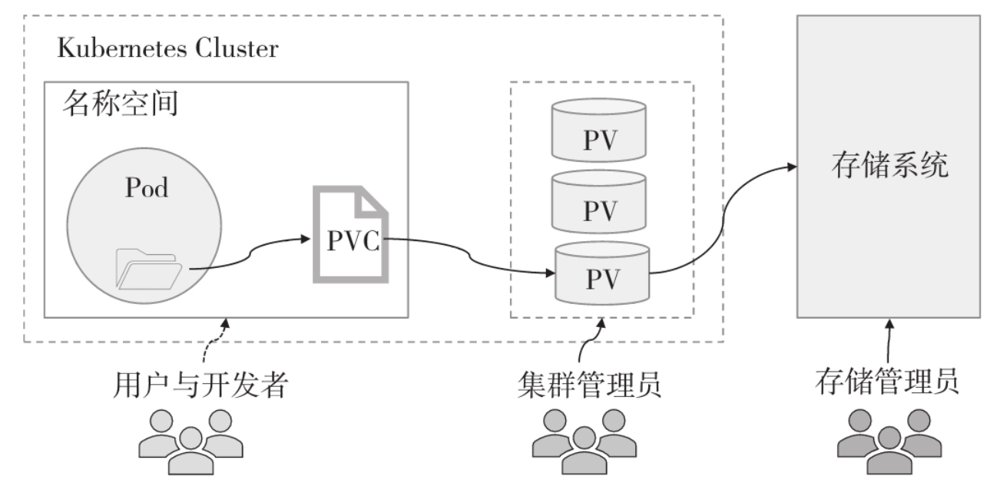
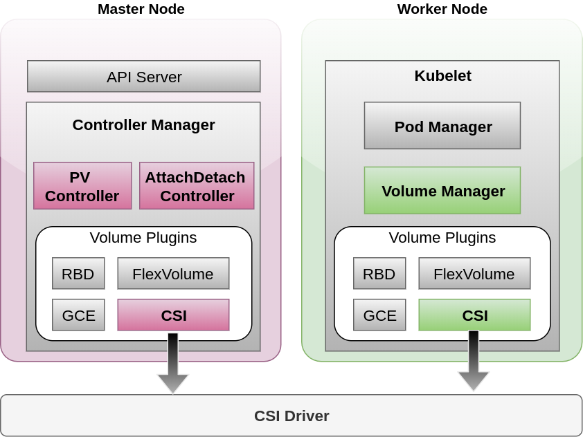
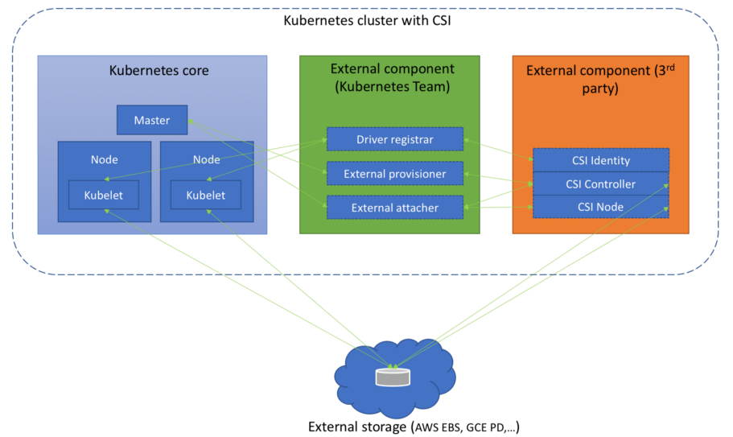
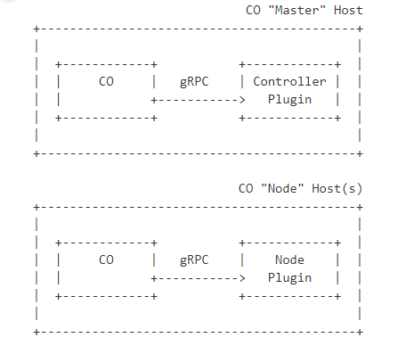
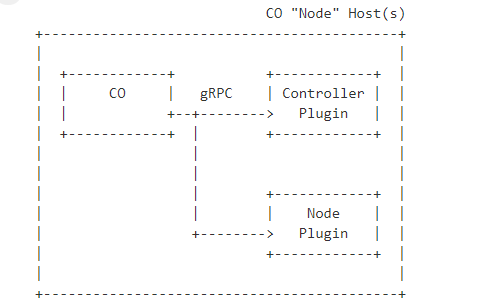
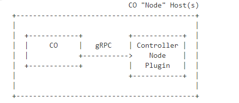
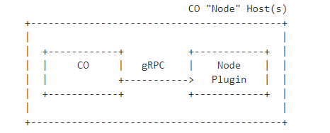

# Kubernetes 存储实现原理及简单示例

## 1 Kubernetes存储相关概念及实现原理

### 1.1 PV & PVC

**概念**

Kubernetes定义了PV（PersistentVolume）与PVC（PersistentVolumeClaim）这两个概念让用户使用持久化存储，是在用户与存储服务提供者之间添加的一个中间层。

*用户*指Kubernetes应用的开发者，*存储服务提供者*一般是Kubernetes集群的运维人员，或者是第三方存储服务提供商的服务人员

存储服务提供者事先根据PV支持的存储卷插件及适配的存储方案（目标存储系统）细节定义好可以支撑存储卷的底层存储空间

然后由用户通过PVC声明要使用的存储特性来绑定符合条件的最佳PV定义存储卷，实现存储系统的使用与管理职能的解耦，大大简化了用户使用存储的方式

**为什么这么设计**

解决2个问题

* 卷对象的生命周期无法独立于Pod而存在
* 用户必须足够熟悉存储的使用和配置才能在Pod上配置和使用卷



PV是由集群管理员于**全局级别**配置的预挂载存储空间，它通过支持的存储卷插件及给定的配置参数关联至某个存储系统上可用数据存储的一段空间，这段存储空间可能是Ceph存储系统上的一个存储映像、一个文件系统（CephFS）或其子目录，也可能是NFS存储系统上的一个导出目录等。

PV将存储系统之上的存储空间抽象为Kubernetes系统全局级别的API资源，由集群管理员负责管理和维护。 将PV提供的存储空间用于Pod对象的存储卷时，用户需要事先使用PVC在**名称空间级别**声明所需要的存储空间大小及访问模式并提交给Kubernetes API Server，接下来由PV控制器负责查找与之匹配的PV资源并完成绑定。随后，用户在Pod资源中使用persistentVolumeClaim类型的存储卷插件指明要使用的PVC对象的名称即可使用其绑定到的PV所指向的存储空间，如图所示。

PV和PVC是一对一的关系：一个PVC仅能绑定一个PV，而一个PV在某一时刻也仅可被一个PVC所绑定。

为了能够让用户更精细地表达存储需求，PV资源对象的定义支持存储容量、存储类、卷模型和访问模式等属性维度的约束。相应地，PVC资源能够从访问模式、数据源、存储资源容量需求和限制、标签选择器、存储类名称、卷模型和卷名称等多个不同的维度向PV资源发起匹配请求并完成筛选。

PV与PVC示例 & 用户使用示例

```yaml
# PV
apiVersion: v1
kind: PersistentVolume
metadata:
  name: pv-nfs
spec:
	# 存储类名称
	storageClassName: manual
	# 存储资源
  capacity:
    storage: 10Gi
	# 访问模式
  accessModes:
    - ReadWriteMany
	# 数据源
  nfs:
    path: /opt/nfs-volume
    server: 172.26.204.144
---
# PVC
kind: PersistentVolumeClaim
apiVersion: v1
metadata:
  name: pvc-nfs
spec:
	storageClassName: manual
  accessModes:
    - ReadWriteMany
  resources:
    requests:
      storage: 10Gi
---
# 用户使用
apiVersion: apps/v1
kind: Deployment
metadata:
  name: test-nfs
  labels:
    app: test
spec:
  replicas: 1
  selector:
    matchLabels:
      app: test
  template:
    metadata:
      labels:
        app: test
    spec:
      containers:
      - name: busybox
        image: busybox
				# 使用卷
        volumeMounts:
        - name: data
          mountPath: /data
			# 声明卷
      volumes:
      - name: data
        persistentVolumeClaim:
          claimName: pvc-nfs
```

PV和PVC的生命周期如下表所示

| 操作                | PV 状态       | PVC 状态   |
| ------------------- | ------------- | ---------- |
| 创建 PV             | Available     | -          |
| 创建 PVC            | Available     | Pending    |
|                     | Bound         | Bound      |
| 删除 PV             | -/Terminating | Lost/Bound |
| 重新创建 PV         | Bound         | Bound      |
| 删除 PVC            | Released      | -          |
| 后端存储不可用      | Failed        | -          |
| 删除 PV 的 claimRef | Available     | -          |

**PV生命周期**

1. 创建后未能正确关联到存储设备的PV处于Pending状态，成功关联后转为Available
2. 一个Available状态的PV与PVC关联后变为Bound状态
3. 处于Bound状态的PV，其关联的PVC被删除后，变为Release状态
4. 当PV的回收策略为recycle或手动删除PVC引用时，PV从Release状态变为Available状态

可选的回收策略：

* Retain（保留）：删除PVC后将保留其绑定的PV及存储的数据，但会把该PV置为Released状态，它不可再被其他PVC所绑定，且需要由管理员手动进行后续的回收操作：首先删除PV，接着手动清理其关联的外部存储组件上的数据，最后手动删除该存储组件或者基于该组件重新创建PV
* Delete（删除）：对于支持该回收策略的卷插件，删除一个PVC将同时删除其绑定的PV资源以及该PV关联的外部存储组件；动态的PV回收策略继承自StorageClass资源，默认为Delete。多数情况下，管理员都需要根据用户的期望修改此默认策略，以免导致数据非计划内的删除
* Recycle（回收）：对于支持该回收策略的卷插件，删除PVC时，其绑定的PV所关联的外部存储组件上的数据会被清空，随后，该PV将转为Available状态，可再次接受其他PVC的绑定请求。不过，该策略已被废弃

1. recycle失败时，PV将从Released状态变为Failed状态
2. 可通过手动删除PVC将PV状态变成Available

**PVC生命周期**

1. 一个Pending状态PVC与PV绑定后变为Bound状态
2. 处于Bound状态的PVC，与其关联的PV被删除后变为Lost状态
3. Lost状态的PVC再次与PV绑定后变成Bound状态

PV和PVC的生命周期可概括为存储制备（Provision）、存储绑定、存储使用、存储回收四个阶段

这是使用Kubernetes存储最基本的模式，但会产生2个问题：

1. 存储服务提供者难以预测用户的真实需求，如果用户提交了一个PVC，但是PV控制器没有找到合适的PV与之绑定，容器创建就会失败
2. 会造成资源浪费，如集群中创建的PV容量都是10G的，但是如果创建了一个声明使用5G的PVC，依然会绑定到10G的PV

因此Kubernetes提供了一种动态自动创建PV的机制，被称为动态制备（dynamic provision），刚刚说的手动创建PV的方式又被称为静态制备（static provision）

### 1.2 StorageClass & Plugin

Kubernetes使用一种API对象叫做存储类（StorageClass）提供动态预配、按需创建PV的机制。需要存储服务提供者事先借助存储类创建出一到多个“PV模板”，并在模板中定义好基于某个存储系统创建PV所依赖的存储组件（例如Ceph RBD存储映像或CephFS文件系统等）时需要用到的配置参数，包括PV的属性如存储类型、Volume大小等以及创建这种PV需要的存储插件

```yaml
# SC示例
apiVersion: storage.k8s.io/v1
kind: StorageClass
metadata:
  name: nfs
# 指定存储服务方（Provisioner，预配器），基于该字段判断使用的存储插件，内置插件以kubernetes.io/为前缀
provisioner: nfs.csi.k8s.io
parameters:
  server: 10.0.0.11
  share: /data
# 默认回收策略
reclaimPolicy: Delete
# 定义如何为PVC完成预配和绑定
volumeBindingMode: Immediate
# 当前类动态创建的PV资源的默认挂载选项
mountOptions:
  - nfsvers=4.1
```

使用动态制备的方式创建PVC时，用户需要为其指定要使用PV模板（StorageClass资源），而后PV控制器会自动连接相应存储类上定义的 **目标存储系统的管理接口** ，请求创建匹配该PVC需求的存储组件，并将该存储组件创建为Kubernetes集群上可由该PVC绑定的PV资源。

Kubernetes通过卷插件（Volume Plugins）的机制接入目标存储系统，Kubernetes定义了一系列管理接口，插件即是在一个存储系统的基础上实现了这些管理接口的代码

卷插件分为In-Tree和Out-of-Tree两类

* In-Tree的代码是放在Kubernetes内部的，和Kubernetes一起发布、管理与迭代，优点是使用方便，缺点是迭代速度慢、灵活性差，目前除了少数通用存储如nfs，hostpath，正在逐渐被废弃
* Out-of-Tree是由存储厂商提供的，有FlexVolume和CSI两种实现机制，目前FlexVolume已被废弃，Kubernetes官方目前提供了生产可用的NFS，SMB，NVMF、host-path四种CSI插件

### 1.3 Kubernetes存储相关组件及架构



* PV控制器（集群维度）：负责PV及PVC的整个生命周期管理，主要监听PV/PVC/SC三类资源，当发现这些资源的CRU操作时，PV控制器会判断是否需要创建、删除、绑定和回收卷；并根据需求进行存储卷的预配和删除操作
* AD控制器（集群维度）：专用于存储设备的附加和拆除操作的组件，能够将存储设备关联（attach）至目标节点或从目标节点之上剥离（detach）
  * AD控制器监听Pod/Node时间，如有必要，调用Volume Plugin执行AD操作
  * 存储卷管理器也能触发AD操作，但它只监听调度到本节点的Pod
* 存储卷管理器（节点维度）：kubelet内置管理器组件之一，用于在当前节点上执行存储设备的挂载（mount）、卸载（unmount）和格式化（format）等操作；另外，存储卷管理器也可执行节点级别设备的附加（attach）及拆除（detach）操作
* 存储卷插件：Kubernetes存储卷功能的基础设施，是存储任务相关操作的执行方；它是存储相关的扩展接口，用于对接各类存储设备

PV控制器、AD控制器和存储卷管理器均构建于存储卷插件之上，以提供不同维度管理功能的接口，具体的实现逻辑均由存储卷插件完成

最初，只有VolumeManager能够Attach/Detach，但是节点宕掉后，它已经挂载的卷需要在其它节点进行Detach，然后再Attach，这个必须依赖外部才能完成，AD控制器因此产生

现在，到底在何处进行Attach/Detach，取决于Volume Plugin，如果实现了Attach相关接口，则在AttachDetach中执行，否则，在Volume Manager上执行

### 1.4 Kubernetes存储实现原理

PV对象成为容器内的持久化存储过程，实际上就是将一个宿主机上的目录跟一个容器里的目录绑定挂载在了一起

如果使用远程存储服务实现容器数据的持久化，Kubernetes所做的就是将这个远程存储服务挂载到宿主机上的一个目录，以供将来进行绑定挂载时使用，这个准备宿主机目录的过程可以称为“两阶段处理”

1 第一阶段Attach，由AD控制器完成，类似于插入硬盘

当一个Pod调度到一个节点上后，kubelet要负责为这个pod创建它的volume目录，默认情况下，kubelet为volume创建的目录是一个宿主机上的路径，如

`/var/lib/kubelet/pods/<Pod ID>/volumes/kubernetes.io-<volume type>/<vulume name>`

接下来进行的操作取决于Volume类型，如使用远程块存储，会调用相应的API，将其提供的持久化盘挂载到宿主机上，如果使用CSI，则会调用相应的CSI接口

2 第二阶段mount，也由存储卷管理器完成，类似于格盘并挂载

完成Attach阶段后，kubelet需要格式化这个磁盘设备并将它挂载到宿主机指定的挂载点上，即之前提到的宿主机目录

mount完成后Volume的宿主机目录就是一个持久化目录了，容器写入的内容会被存储在存储服务中，如果Volume类型是远程文件存储服务（如NFS），kubelet会跳过attach阶段，因为使用NFS不需要经过“插盘”这个操作，直接mount即可

Kubernetes 通过在具体的插件实现接口上提供不同的参数列表，定义和区分这两个阶段

* 第一阶段Kubernetes通过nodeName，即宿主机的名字区分
* 第二阶段通过dir，即Volume宿主机的目录区分

完成两阶段处理后，kubelet只需将这个volume目录通过CRI里的Mounts参数传递给Docker，就可以为Pod里的容器挂载这个持久化的Volume了

### 1.5 CSI 介绍

Kubernetes从1.8版本开始已经停止接受in-tree卷插件，并建议所有供应商实现out-of-tree卷插件，而2种out-of-tree卷扩展机制之一的flexvolume已经被废弃，所以目前CSI目前已成为接入自定义存储的唯一途径

**CSI架构**



CSI，全称Container Storage Interface，是一种规范，在Kubernetes核心存储(即上文提到的PV控制器、AD控制器等)之外，CSI又引入了2组外部组件，方便存储提供者开发和使用CSI标准

一组由Kubernetes官方提供，一系列external组件负责注册CSI Driver（即第三方提供的存储插件）或监听Kubernetes对象资源，从而发起csi Driver调用，都作为CSI Controller的sidecar容器

* node-driver-register：一个sidecar容器，可从CSI driver获取驱动程序信息（使用NodeGetInfo），并使用kubelet插件注册机制在该节点上的kubelet中对其进行注册
* External Provisioner：一个sidecar容器，用于监视Kubernetes PersistentVolumeClaim对象并针对驱动程序端点触发CSI CreateVolume和DeleteVolume操作。external-attacher还支持快照数据源。如果将快照CRD资源指定为PVC对象上的数据源，则此sidecar容器通过获取SnapshotContent对象获取有关快照的信息，并填充数据源字段，该字段向存储系统指示应使用指定的快照填充新卷
* External Attacher：一个sidecar容器，用于监视Kubernetes VolumeAttachment对象并针对驱动程序端点触发CSI ControllerPublish和ControllerUnpublish操作
* livenessprobe：一个sidecar容器，用于监视CSI驱动程序的运行状况，并通过Liveness Probe机制将其报告给Kubernetes。这使Kubernetes能够自动检测驱动程序问题并重新启动Pod以尝试解决问题
* External Resizer：一个sidecar容器，监听PVC对象，如果用户在PVC对象请求更多存储，该组件会调用CSI Controller的NodeExpandVolume接口对volume进行扩容
* External Snapshotter：一个Snapshot Controller的sidecar容器，Snapshot Controller会根据集群中创建的Snapshot对象创建对应的VolumeSnapshotContent，而External Snapshotter负责监听之，监听到其发生变化时，将其对应参数传递给CSI Controller，调用其CreateSnapshot接口

另一组需要存储提供者实现，也是卷插件必须的组成部分，这组中包括3个服务，分别需要实现三组grpc接口

* CSI Identity： 提供插件信息、能力、探测插件状态
* CSI Controller（Provision和Attach）：负责创建和管理卷
* CSI Node（mount）：在节点上完成和卷相关的功能，如Publish/Unpublish，Stage/Unstage

CSI中Capabilities会标识出来此插件提供哪些能力，如IdentityServer中的GetPluginCapabilities方法，ControllerServer中的ControllerGetCapabilities方法和NodeServer中的NodeGetCapabilities

**CSI交互模型**

Kubelet和CSI插件的交互方式：

1. Kubelet直接通过UDS，向CSI发起NodeStageVolume、NodePublishVolume等调用
2. Kubelet通过插件注册机制来发现CSI插件及其UDS。这意味着CSI插件必须在任何节点上进行Kubelet插件注册

Master和CSI插件的交互方式：

1. K8S控制平面不直接和CSI插件交互
2. K8S控制平面组件仅仅通过K8S API进行相互交互
3. CSI插件必须监控相关K8S API资源，并触发对应的CSI操作，例如卷创建、Attach、快照生成等

**CSI对象**

Kubernetes提供了2个CSI相关的API对象CSIDriver和CSINode，方便CSI插件集成到Kubernetes

CSIDriver提供的功能：

* 简化CSI驱动的发现：在安装时附带一个CISDrive对象，就可以将存储提供者的插件注册到Kubernetes中
* 定制K8S的行为：Kubernetes具有一套和CSI驱动交互的默认规则，例如默认它会调用Attach/Detach操作。使用CSIDriver··对象可以定制这一行为

CSIDriver示例：

```yaml
apiVersion: storage.k8s.io/v1
kind: CSIDriver
metadata:
  # 和CSI驱动的全名一致
  name: mycsidriver.example.com
spec:
  # 提示K8S，此驱动需要Attach操作（因为驱动实现了ControllerPublishVolume方法），
  # 并且需要在Attach之后等待操作完成，然后再进行后续的Mount操作
  # 默认值true
  attachRequired: true
  # 提示K8S，在挂载阶段，此驱动需要Pod的信息（名称、Pod的UID等）
  # Pod信息会在NodePublishVolume调用中作为volume_context传递：
  #   "csi.storage.k8s.io/pod.name": pod.Name
  #   "csi.storage.k8s.io/pod.namespace": pod.Namespace
  #   "csi.storage.k8s.io/pod.uid": string(pod.UID)
  #   "csi.storage.k8s.io/serviceAccount.name": pod.Spec.ServiceAccountName
  podInfoOnMount: true
  # 1.16中添加，到1.18为止beta
  # 此驱动支持的Volume Mode
  volumeLifecycleModes:
  - Persistent    # 默认，常规PV/PVC机制
  - Ephemeral     # 内联临时存储（inline ephemeral volumes）
```

由CSIDrive注册后就可以通过kubectl查看所有安装的CSI驱动

```bash
kubectl get csidrivers.storage.k8s.io
```

CSINode对象存放CSI驱动产生的、节点相关的信息，它的功能是：

* 映射K8S节点名称到CSI节点名称：CSI的GetNodeInfo调用返回的name，是存储系统引用节点使用的名字。在后续的ControllerPublishVolume调用中K8S使用该名字引用节点
* 为kubelet提供和kube-controller-manager、kube-scheduler交互的机制，不管CSI插件是否可用（注册到节点）
* 卷拓扑：CSI的GetNodeInfo调用会返回一系列标签（键值对），来识别节点的拓扑信息。K8S使用这些信息进行拓扑感知的卷创建。这些键值对存放在Node对象中，Kubelet会把键存放在CSINode中，供后续引用

CSINode示例：

```yaml
apiVersion: storage.k8s.io/v1
kind: CSINode
metadata:
  name: node1
spec:
  drivers:
  - name: mycsidriver.example.com
    nodeID: storageNodeID1
    topologyKeys: ['mycsidriver.example.com/regions', "mycsidriver.example.com/zones"]
```

### 1.6 CSI插件实现

存储提供者需要实现三个服务，CSI Identity，CSI Controller和CSI Node，这是在CSI规范中定义的，即上文提到的外部组件，这三个服务必须实现一组grpc接口

CSI Identity

```protobuf
// 让调用者（K8S组件、CSI Sidecar容器）能识别驱动，知晓它具有哪些可选特性
service Identity {
	// 获取插件名称和版本
  rpc GetPluginInfo(GetPluginInfoRequest)
    returns (GetPluginInfoResponse) {}
 // 获取插件功能
  rpc GetPluginCapabilities(GetPluginCapabilitiesRequest)
    returns (GetPluginCapabilitiesResponse) {}
	// 检查插件是否运行
  rpc Probe (ProbeRequest)
    returns (ProbeResponse) {}
}
```

CSI Controller（Provision和Attach），可以运行在任何节点，实现创建卷、创建快照等功能，可选

```protobuf
service Controller {
	// 必须实现
  rpc CreateVolume (CreateVolumeRequest)
    returns (CreateVolumeResponse) {}

  // 必须实现
  rpc DeleteVolume (DeleteVolumeRequest)
    returns (DeleteVolumeResponse) {}
 
  rpc ControllerPublishVolume (ControllerPublishVolumeRequest)
    returns (ControllerPublishVolumeResponse) {}
 
  rpc ControllerUnpublishVolume (ControllerUnpublishVolumeRequest)
    returns (ControllerUnpublishVolumeResponse) {}
  
  // 必须实现
  rpc ValidateVolumeCapabilities (ValidateVolumeCapabilitiesRequest)
    returns (ValidateVolumeCapabilitiesResponse) {}
 
  rpc ListVolumes (ListVolumesRequest)
    returns (ListVolumesResponse) {}
 
  rpc GetCapacity (GetCapacityRequest)
    returns (GetCapacityResponse) {}

  // 必须实现
  rpc ControllerGetCapabilities (ControllerGetCapabilitiesRequest)
    returns (ControllerGetCapabilitiesResponse) {}
 
	// nfs-csi已实现
  rpc CreateSnapshot (CreateSnapshotRequest)
    returns (CreateSnapshotResponse) {}

	// nfs-csi已实现
  rpc DeleteSnapshot (DeleteSnapshotRequest)
    returns (DeleteSnapshotResponse) {}
 
  rpc ListSnapshots (ListSnapshotsRequest)
    returns (ListSnapshotsResponse) {}
 
  rpc ControllerExpandVolume (ControllerExpandVolumeRequest)
    returns (ControllerExpandVolumeResponse) {}
 
  rpc ControllerGetVolume (ControllerGetVolumeRequest)
    returns (ControllerGetVolumeResponse) {
        option (alpha_method) = true;
    }

  rpc ControllerModifyVolume (ControllerModifyVolumeRequest)
	  returns (ControllerModifyVolumeResponse) {
	      option (alpha_method) = true;
	  }
}
```

CSI Node（mount），任何存储提供者的卷，想要Publish的节点都需要运行此插件

```protobuf
service Node {
  rpc NodeStageVolume (NodeStageVolumeRequest)
    returns (NodeStageVolumeResponse) {}
 
  rpc NodeUnstageVolume (NodeUnstageVolumeRequest)
    returns (NodeUnstageVolumeResponse) {}
 
	// 将卷挂载到节点上
  rpc NodePublishVolume (NodePublishVolumeRequest)
    returns (NodePublishVolumeResponse) {}

	// 卸载卷
  rpc NodeUnpublishVolume (NodeUnpublishVolumeRequest)
    returns (NodeUnpublishVolumeResponse) {}

  // 获取卷状态
  rpc NodeGetVolumeStats (NodeGetVolumeStatsRequest)
    returns (NodeGetVolumeStatsResponse) {}
 
  rpc NodeExpandVolume(NodeExpandVolumeRequest)
    returns (NodeExpandVolumeResponse) {}

  // 必须实现
  rpc NodeGetCapabilities (NodeGetCapabilitiesRequest)
    returns (NodeGetCapabilitiesResponse) {}
	 
	// 必须实现，返回运行插件的节点的信息
  rpc NodeGetInfo (NodeGetInfoRequest)
    returns (NodeGetInfoResponse) {}
}
```

某些部署架构下，也可由一个服务（可以是一个二进制文件）同时提供CSI Controller和CSI Node两组接口

### 1.7 CSI部署架构

CSI规范的主要关注点是Kubernetes和卷插件之间的协议。Kubernetes应该同时支持中心化部署、headless部署的Plugin。几种可能的部署架构：

注：headless指Kubernetes中的一种服务的配置方式，它允许您直接访问服务中的各个Pod而不是通过一个集群IP来访问整个服务。headless服务实现上是为与服务关联的每个 Pod 创建 DNS 记录。然后，可以使用这些 DNS 记录直接对每个 Pod 进行寻址

1. 插件运行在所有节点上，在Master上运行中心化的控制器，所有节点上运行Node Plugin：



注： CO即为容器编排系统（指Kubernetes），使用CSI的RPC接口和CSI插件交互

2. Headless部署，在所有节点上运行Plugin，Controller Plugin、Node Plugin分开部署：



3. Headless部署，在所有节点上运行Plugin，Controller Plugin、Node Plugin合并部署：



4. Headless部署，在所有节点上运行Plugin，只运行Node Plugin。GetPluginCapabilities调用不会报告CONTROLLER_SERVICE特性：



## 2 Kubernetes接入NFS存储方式及配置示例

1. 直接使用nfs卷，k8s内置支持(提前部署nfs-server：10.1.33.53)

```yaml
apiVersion: apps/v1
kind: Deployment
metadata:
  name: nginx-deployment
  labels:
    app: nginx
spec:
  replicas: 3
  selector:
    matchLabels:
      app: nginx
  template:
    metadata:
      labels:
        app: nginx
    spec:
      containers:
      - name: nginx
        image: nginx:1.14.2
        ports:
        - containerPort: 80
        volumeMounts:
        - name: data
          mountPath: /usr/share/nginx/html
      volumes:
      - name: data
        nfs:
          path: /opt/nfs-deployment
          server: 10.1.33.53
```

2. 将nfs创建为PV，并创建相应PVC，在容器中使用，静态绑定

```yaml
# PV
apiVersion: v1
kind: PersistentVolume
metadata:
  name: pv-nfs
spec:
	storageClassName: manual
  capacity:
    storage: 10Gi
  accessModes:
    - ReadWriteMany 
  nfs:
    path: /opt/nfs-deployment
    server: 172.26.204.144
---
# PVC
kind: PersistentVolumeClaim
apiVersion: v1
metadata:
  name: pvc-nfs
spec:
	storageClassName: manual
  accessModes:
    - ReadWriteMany
  resources:
    requests:
      storage: 10Gi
---
# 使用
apiVersion: apps/v1
kind: Deployment
metadata:
  name: busybox
  labels:
    app: busybox
spec:
  replicas: 1
  selector:
    matchLabels:
      app: busybox
  template:
    metadata:
      labels:
        app: busybox
    spec:
      containers:
      - name: busybox
        image: busybox
        command: ['sh', '-c', 'echo "Hello, Kubernetes!" && sleep 3600']
        volumeMounts:
        - name: data
          mountPath: /data
      volumes:
      - name: data
        persistentVolumeClaim:
          claimName: pvc-nfs
```

3. K8S官方CSI插件，本身只提供了集群中的资源和NFS服务器之间的通信层，Driver直接使用官方的安装即可，使用如下

注：动态绑定需要注意权限问题，弄清楚是以什么账号权限访问的，配置读写权限是否具有读写权限

```yaml
# 静态绑定
apiVersion: v1
kind: PersistentVolume
metadata:
  name: pv-nfs-csi
spec:
  capacity:
    storage: 10Gi
  accessModes:
    - ReadWriteMany
  persistentVolumeReclaimPolicy: Retain
  mountOptions:
    - hard
    - nfsvers=4.1
  csi:
    driver: nfs.csi.k8s.io
    readOnly: false
    volumeHandle: unique-volumeid  # #确保它是集群中的唯一 ID
    volumeAttributes:
      server: 172.26.204.144
      share: /opt/nfs-deployment
---
kind: PersistentVolumeClaim
apiVersion: v1
metadata:
  name: pvc-nfs-csi-static
spec:
  accessModes:
    - ReadWriteMany
  resources:
    requests:
      storage: 10Gi
  volumeName: pv-nfs-csi
  storageClassName: ""

# 动态绑定
apiVersion: storage.k8s.io/v1
kind: StorageClass
metadata:
  name: nfs-csi
provisioner: nfs.csi.k8s.io
parameters:
  server: 172.26.204.144
  share: /opt/nfs-deployment
reclaimPolicy: Delete
volumeBindingMode: Immediate
mountOptions:
  - hard
  - nfsvers=4.1
---
apiVersion: v1
kind: PersistentVolumeClaim
metadata:
  name: pvc-nfs-csi-dynamic
spec:
  accessModes:
    - ReadWriteMany
  resources:
    requests:
      storage: 10Gi
  storageClassName: nfs-csi
```

## 3 Reference

[https://github.com/container-storage-interface/spec/blob/master/spec.md](https://github.com/container-storage-interface/spec/blob/master/spec.md)

[https://kubernetes.io/docs/reference/generated/kubernetes-api/v1.29/#api-overview](https://kubernetes.io/docs/reference/generated/kubernetes-api/v1.29/#api-overview)

[https://kubernetes-csi.github.io/docs/introduction.html](https://kubernetes-csi.github.io/docs/introduction.html)

