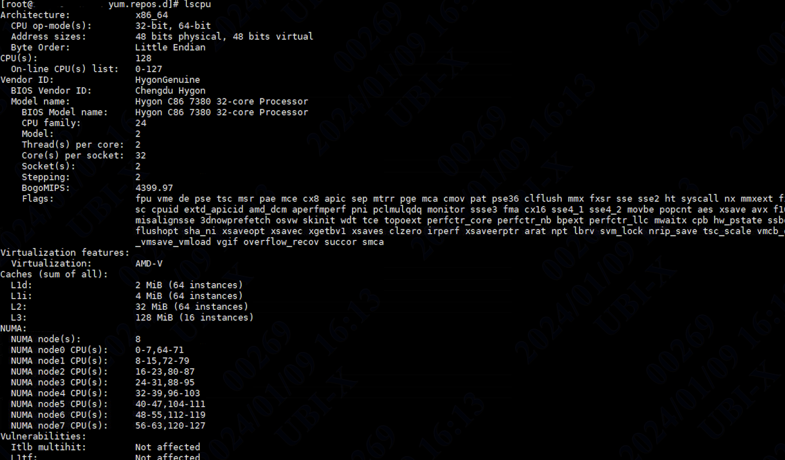
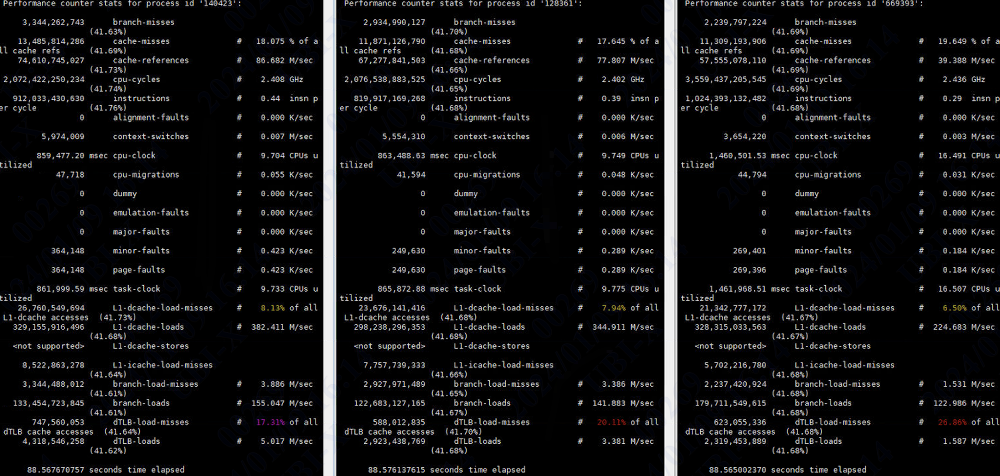

# 记一次CPU占用过高问题定位

记录一次对象存储在曙光服务器（Hygon CPU）上CPU占用异常问题的定位过程，相关信息已脱敏

## 环境说明

CPU规格：每个服务器2 * Hygon C86 7380 32-Core Processor，一共128个虚拟核，具体规格如下：




通过lstopo --of png > out.png 命令可以看到服务器CPU（numa架构）的及其外设（内存、硬盘、网卡）的拓扑结构图

## 问题现象

3个节点的集群跑216并发的128M大对象，测试集群带宽，对象存储进程CPU占用上千，是正常节点CPU占用的数十倍，且CPU利用率高在三个节点中随机出现，最少1个节点出现，最多3个节点出现


通过perf命令抓取性能数据，发现CPU利用率与IPC负相关，与L1-dcache-loads负相关，与dTLB-loads负相关

下图最右边节点的CPU利用率最高



## 定位结论

是Hygon CPU本身的问题，CPU占用高是CPU内部调度的问题

## 定位过程

1. 确定硬盘和网络都不是瓶颈
2. 屏蔽对象存储服务进程的后台任务，不改变该现象
3. 使用go pprof工具排除程序本身的问题
4. 通过perf工具确定CPU利用率高的节点上CPU流水线的效率很低，各节点CPU效率有数倍差距
5. 经过绑核验证，使用128核/64核/32核/16核/8核都能支持1.5G的对象带宽，无论绑多少核CPU都能用满

## 调优建议

1. 建议在Hygon CPU上部署对象存储服务时使用16核的绑核方式（即numa中的一个node），例：

```shell
taskset -apc 32-39, 96-103 2638647
```

其中，32-29, 96-103是绑定的CPU核的变化，可以通过Iscpu获取，或者numactl-H获取；2638647 是需要绑核的进程ID

2. 当限制核数以后，会导致prometheus获取metrics效据变慢，具体表现在对象存储服务和node_exporter向prometheus回写数据非常慢。绑16核的场景下，回写metrics最多要花37秒，因此建议作出如下调整：
   1. 延长prometheus的指标拉取周期，由15秒拉取一次调整为1分钟拉取一次
   2. 延长prometheus的指标拉取超时时长，由10秒超时调整为55秒超时

